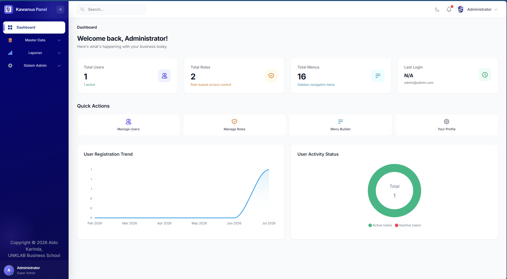
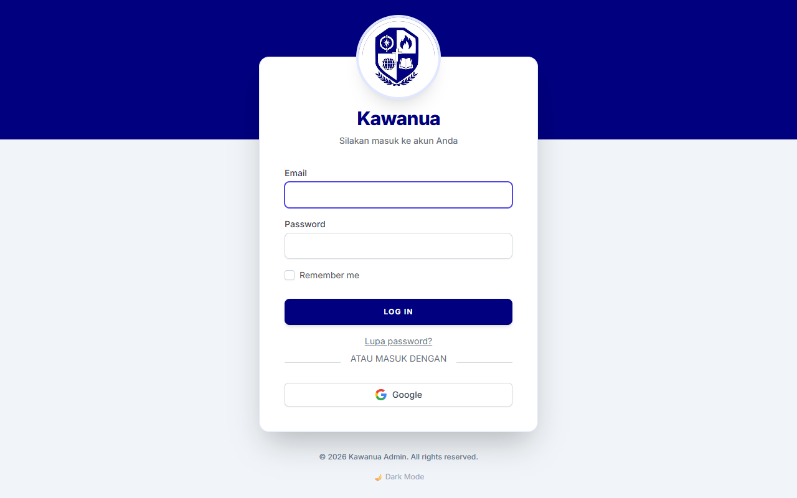
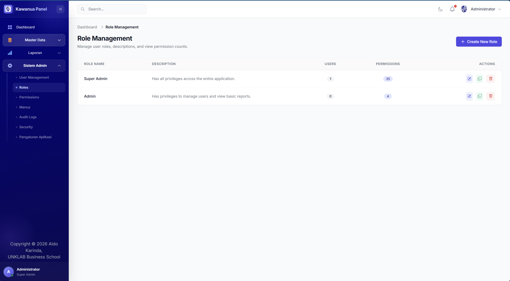
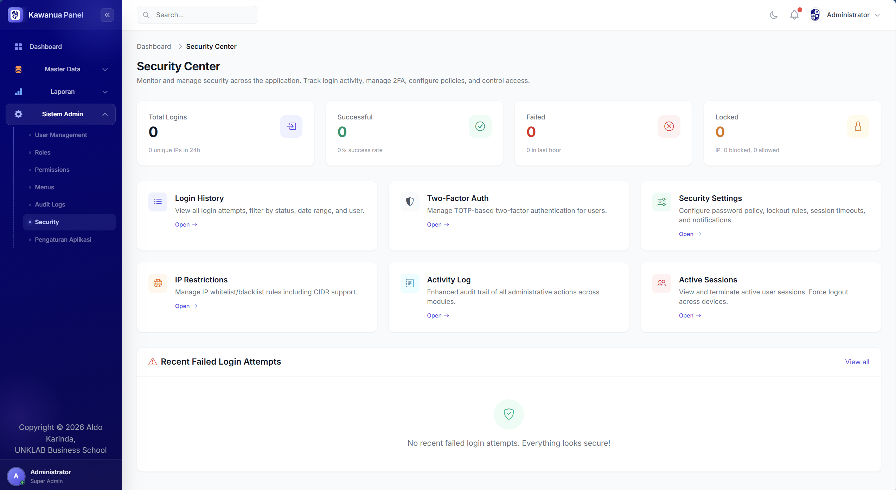
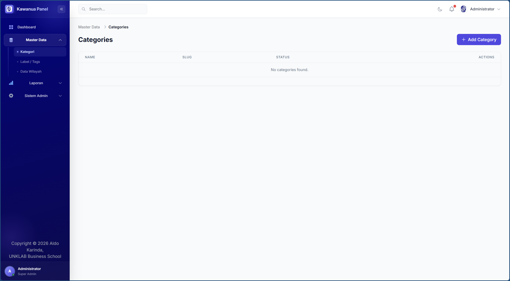

# Kawanua Admin Panel

[](LICENSE)
[](https://laravel.com)
[](https://php.net)

**Kawanua Admin Panel** is a premium, modern, and lightweight administrative dashboard template built on Laravel 13, Tailwind CSS, and Alpine.js. Out of the box, it delivers a clean SaaS-like interface, a dynamic menu builder, an advanced Role-Based Access Control (RBAC) system, and a comprehensive security suite.

---

## 📸 Screenshots

### 1. Dashboard


### 2. User Management


### 3. Role Management


### 4. Security Dashboard


### 5. Master Data


---

## ✨ Key Features

- **Tailwind CSS & Alpine.js**: Fast, lightweight, zero jQuery dependencies, and clean native styling.
- **Dynamic Menu Builder**: Easily create, manage, and order your hierarchical sidebar menus directly from the database using a visual tree interface.
- **Advanced RBAC System**: Full User, Role, and Permission management utilizing Spatie Laravel Permission with an active role cloning utility.
- **Premium Layouts**: Responsive desktop and mobile drawer layouts featuring smooth sidebar width collapses, hover states, and active menu glow bar indicators.
- **Split-Pane Forms**: Contextual input forms designed for high readability and structured data entry.
- **Ultimate DataTables**: Elegant, searchable tables supporting bulk actions, quick filters, and context menus.
- **Visual Icon Picker**: Choose from the built-in Bootstrap Icons list when creating menus instead of dealing with manual markup.
- **Modern Load Indicators**: Fitted with non-blocking `NProgress` loading bars for smooth page transitions.

### 🛡️ Enterprise Security Suite
- **Security Dashboard**: High-level statistics on login activity, active IP restrictions, and quick system status reports.
- **Two-Factor Authentication (2FA)**: Pure-PHP RFC 6238 TOTP implementation supporting visual QR code setup, recovery codes, and administrative bypass/reset actions.
- **Active Session Management**: Monitor active user sessions, view client agent details, and force terminate/logout individual or all active user sessions remotely.
- **Consolidated Activity Log**: Granular database audit logs showing exact modifications (`getChanges()`), modules, actions, IP addresses, and user agents.
- **IP Restrictions**: Dynamic whitelisting and blacklisting of specific IP addresses or CIDR ranges with custom expiration times.
- **Security Settings**: Global rules for configuring password policy strength (mix cases, numeric, symbols), failed login lockouts, and inactive auto-logout timers.

### 🔌 API Authentication Layer
- **Refresh Token Rotation (RTR)**: Highly secure token system powered by Laravel Sanctum.
- **Access Token TTL**: Short-lived access tokens valid for 15 minutes.
- **Refresh Token TTL**: Rotation token valid for 7 days. Single-use rotation prevents token replay attacks.
- **Breach Containment**: Re-use of any previously rotated refresh token triggers automatic compromise containment, revoking ALL active tokens for that user immediately.

---

## 🚀 Getting Started

Follow these instructions to get a copy of the project up and running on your local machine for development and testing purposes.

### Prerequisites

- PHP >= 8.3
- Composer
- Node.js & npm
- MySQL / PostgreSQL / SQLite

### Installation

1. **Clone the repository:**
   ```bash
   git clone https://github.com/aldokarinda/kawanua-admin-laravel.git
   cd kawanua-admin-laravel
   ```

2. **Setup and compile front-end assets:**
   Run the quick setup script to install dependencies, generate key, and build assets:
   ```bash
   composer run setup
   ```
   *Alternatively, run `composer install` and `npm install && npm run build` manually.*

3. **Configure your database in `.env`:**
   ```env
   DB_CONNECTION=mysql
   DB_HOST=127.0.0.1
   DB_PORT=3306
   DB_DATABASE=kawanua
   DB_USERNAME=root
   DB_PASSWORD=
   ```

4. **Run database migrations and seeders:**
   Installs the required tables and seeds the default roles, dynamic English menus, and default configurations:
   ```bash
   php artisan migrate --seed
   ```

5. **Serve the application:**
   ```bash
   php artisan serve
   # In another terminal run: npm run dev
   ```

---

## 🔑 Default Credentials

After running the database seeder, log in with the default Super Admin account:

- **Email:** `admin@admin.com`
- **Password:** `password`

---

## 📄 License

This project is licensed under the Non-Commercial Software License Agreement. It is **free for personal, educational, and other non-commercial purposes**. Using this software for any commercial purpose requires a paid commercial license. See the [LICENSE](LICENSE) file for details.

Copyright &copy; 2026 Aldo Karinda, UNKLAB Business School
